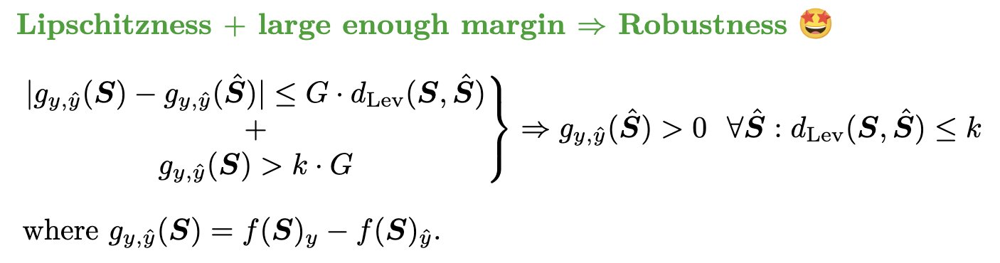

# Certified Robustness Under Bounded Levenshtein Distance

[](./LICENSE)[](https://openreview.net/forum?id=cd79pbXi4N)



Official implementation in PyTorch of the **ICLR 2025 paper "Certified Robustness Under Bounded Levenshtein Distance"**.

## Requirements

### Packages

Just install these packages:

`
torch
numpy
pandas
datasets
tqdm
scipy
`

with the command:

```bash
pip install -r requirements.txt
```

### Data

Most of the datasets are available in the `datasets` package and will be downloaded automatically when running the code. For the Fake-News dataset, please download `train.csv` and `test.csv` from [here](https://www.kaggle.com/competitions/fake-news) and put them in a folder called `fake-news`.

## Training

In order to train the models used in the paper, you can run the scripts available in the `scripts` folder. For example, to train the ConvLips model on the AG-News dataset with $p=2$, you can run:

```bash
python3 train.py --datase ag_news --kernel_size 10 --n_classes 4 --lr 100 --seed 1 --valid_size 0 --p 2
```

For other activation functions, number of layers, etc., please refer to the arguments of `train.py`.

## Verification

To verify the robustness of the models, you can run the `verify.py` script. 

As an example, we provide a pre-trained model for the AG-News dataset, and its verification results in the `results/example` folder. To verify the robustness of this model, you can run `scripts_verif/verify_ag_news.sh`, which is equivalent to running:

```bash
python3 verify.py --dataset ag_news --model_path results/example_ag_news/weights_last.pt --n_classes 4 --n_samples 10
```

This script will verify the robustness of the model on the first 10 samples of the AG-News dataset. The results will be saved in the `results/example_ag_news` folder, with one file for each of these methods:

- `_results_bruteforce.csv`: Brute force verification method
- `_results_ibp.csv`: IBP-based verification method in [(Huang et al., 2019)](https://aclanthology.org/D19-1419/)
- `_results_charmer.csv`: Adversarial accuracy up to $k=2$ with [Charmer](https://openreview.net/forum?id=AZWqXfM6z9)
- `_results_rsdel.csv`: Randomized Smoothing method in [(Huang et al., 2023)](https://arxiv.org/abs/2302.01757)
- `_results_lipslev.csv`: Our method

As an example, the `_results_lipslev.csv` file will look like this:

```
sentence,true_label,pred_label,margin,radius,time
Fears for T N pension after talks Unions representing workers at Turner   Newall say they are 'disappointed' after talks with stricken parent firm Federal Mogul.,2,0,,,
"The Race is On: Second Private Team Sets Launch Date for Human Spaceflight (SPACE.com) SPACE.com - TORONTO, Canada -- A second\team of rocketeers competing for the  #36;10 million Ansari X Prize, a contest for\privately funded suborbital space flight, has officially announced the first\launch date for its manned rocket.",3,3,2.302485466003418,2.0,0.003448009490966797
```

where each row corresponds to a sample in the dataset and each column is:

- `sentence`: the sentence
- `true_label`: the true label
- `pred_label`: the predicted label (the verification method will start if it's equal to the true label)
- `margin`: the margin of the clean sample
- `radius`: the certified radius of the sample
- `time`: the time taken to verify the robustness of the sample

## Citations

If you use the Charmer implementation, please cite the following paper:

```bibtex
@inproceedings{Abad2024Charmer,
  author = {Abad Rocamora, Elias and Wu, Yongtao and Liu, Fanghui and Chrysos, Grigorios G and Cevher, Volkan},

  title = {Revisiting Character-level Adversarial Attacks for Language Models},

  booktitle = {International Conference on Machine Learning (ICML)},

  year = {2024}
}
```

If you use the LipsLev implementation, please cite the following paper:

```bibtex
@inproceedings{Abad2024LipsLev,
  author = {Abad Rocamora, Elias and Chrysos, Grigorios G and Cevher, Volkan},

  title = {Certified Robustness Under Bounded Levenshtein Distance},

  booktitle = {International Conference on Learning Representations (ICLR)},

  year = {2025}
}
```


